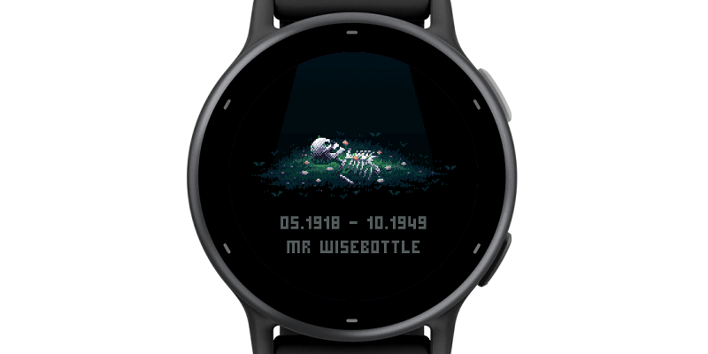
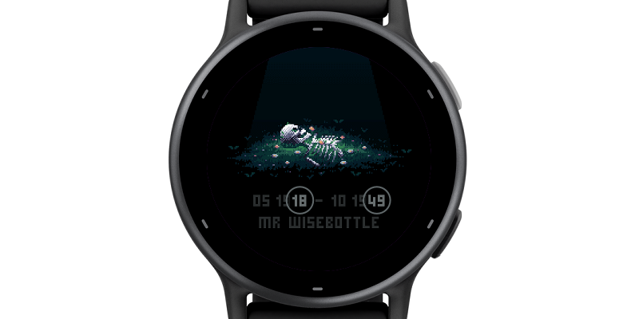
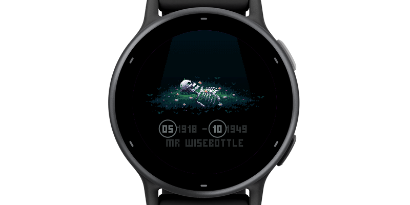

## Rest In Pixels

A watch face for AMOLED Garmin watches.

Built around a [pixel art piece](https://cara.app/post/21679689-237a-4ce4-afd9-699fbcf5c8cc) by [NandooPx](https://linktr.ee/nandoo.px), this is more of a curio than a watch face.

The last two digits of the date of birth is hours. The last two of the date of death is minutes.

The birth month is the current day of the week. The death month is the battery level, 1 to 10.

The name changes every 10 minutes and comes from the list of around 150, mainly populated with unusual British last names with some one-offs sprinkled in. You'll know them once you see them.

### Functional notes

In always-on mode the watch face uses image masking to facilitate burn-in protection. Luckily since it's a pixel art to begin with, the mask fits right in and only compliments the visuals.

When awoken, the watch face plays a little transitional animation to highlight HH:MM and fade in the name of the deceased. The animation is suppressed when the battery is below 20%.

This behavior can be changed by long-tapping the screen and cycling the face between "high fps", "auto fps" and "low fps" modes. "High" will play animation always, "low" will always suppress it and "auto" is the default.

### The artist

This watch face would've not existed if not for the brilliant piece of work by the artist, NandooPx, who has graciously allowed for it to be used for this project. I invite you all to check out the original and their other works over at https://linktr.ee/nandoo.px.

